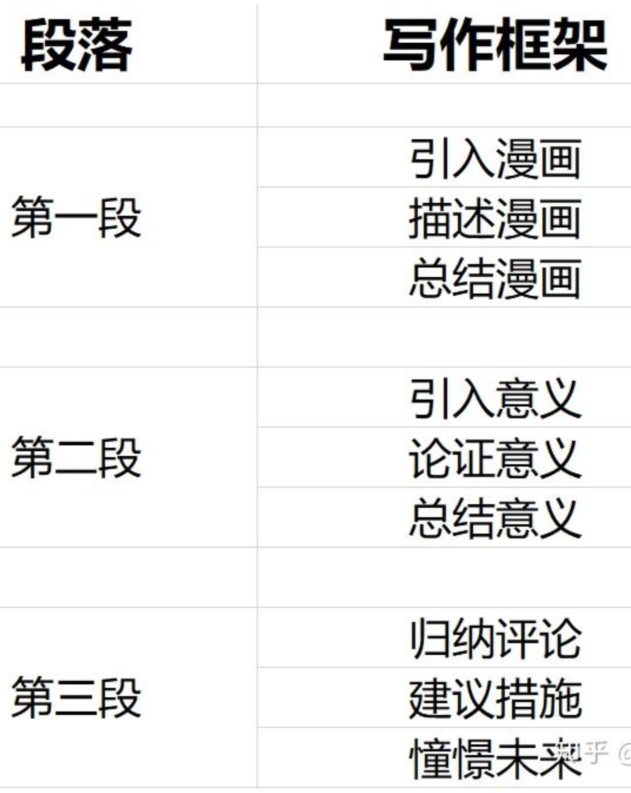

# 总结
目的：调研考研英语作文情况。

阅读顺序：
1. 最后五十天如何写好考研英语作文？ - 英语杂货铺的回答 - 知乎
https://www.zhihu.com/question/20599386/answer/1584823404

    大作文：总结：第一段描述；第二段阐释（基于图表的原因，背景等）；第三段个人评论可以适当扯一下。踩点！详情看文章。
    小作文：格式和内容。

2. help!！！急问学长学姐（最好有考研英语阅卷经历），我这样背模板会重合吗？阿里嘎多！? - 英语杂货铺的回答 - 知乎
https://www.zhihu.com/question/431467732/answer/1588926772

    对于模版的讲述。

3. 考研英语作文使用模板真的会不给分吗？ - 英语杂货铺的回答 - 知乎
https://www.zhihu.com/question/357380931/answer/929132330

    和第一个内容差不多。

**1. 看到这里基本对于文章的结构有所了解。要注意的事项。阅卷的心理。明确的给分点。**

**2. 留三套真题后面自我练习使用**

4. https://zhuanlan.zhihu.com/p/51493142 
   
   **挺好的思路分析，把握主旨。很好的一个分析**

5. 背王江涛作文的同学当年考研英语作文得了多少分？用他的作文的人太多，会不会相同的太多，导致分不是很高？ - 日久的回答 - 知乎
https://www.zhihu.com/question/296825242/answer/1531575396

    **关于反复贴题的讨论，还挺有意思。可以看一下。**

6. 考研英语作文王江涛，张国静和刘晓燕跟哪个老师啊？ - 顾不得的回答 - 知乎
https://www.zhihu.com/question/330587448/answer/796251919
    
    **不用都看，随意看看。针对英语一，自己设计了一个框架，可以参考而已，其他文字没什么用，不用看。**
     

7. 考研英语作文王江涛，张国静和刘晓燕跟哪个老师啊？ - 灰猫警长z的回答 - 知乎
https://www.zhihu.com/question/330587448/answer/1527042735

    **看第三/四精华部分模版与建议，末尾还有信件部分。**

**其实到了这里还没有涉及到真正的模版，只是对于如何使用模版有一些建议。我的总结如下：**
   1. 阅读许多模版。形成自己认为不错的模版。
   2. 从模版中抽出框架，参考第六个问题回答那儿，可以设计出自己的一套框架。
   3. 此时框架已经弄好了，按照这个框架把每一段多积累几个备选句子。
   4. 模拟真题，不断完善模版，一定要模拟10套真题以上（除了近三年）。在这个期间会不断改善自己的模版，也知道根据什么样不同的话题怎么写比较好。
   5. 觉得自己总结的不错之后，开始限时写之前预留的三套真题，把每一次都当作考试来写，发现问题。
   6. 不断熟悉模版。
    
接下来都是模版类的答案，可以尝试从中抽句子出来。

8. 考研英语作文王江涛，张国静和刘晓燕跟哪个老师啊？ - 巨微考研君的回答 - 知乎
https://www.zhihu.com/question/330587448/answer/1358622434
    
    **大作文万能句式，推荐一看。**

9. 考研英语作文王江涛，张国静和刘晓燕跟哪个老师啊？ - 樱桃酱的回答 - 知乎
https://www.zhihu.com/question/330587448/answer/840416820

    中间有一部分：**合理搭建文章结构**值得一看。

10. 最后五十天如何写好考研英语作文？ - 知乎
https://www.zhihu.com/question/20599386/answer/846569619
   
    **直接看图即可，都是模版** 

11. 最后五十天如何写好考研英语作文？ - 清欢的回答 - 知乎
https://www.zhihu.com/question/20599386/answer/875106038
    
    **给出了超多模版，可以参考**

12. 最后五十天如何写好考研英语作文？ - 清欢的回答 - 知乎
https://www.zhihu.com/question/20599386/answer/875106038
    
    **给出了超多模版，可以参考**

13. 背王江涛作文的同学当年考研英语作文得了多少分？用他的作文的人太多，会不会相同的太多，导致分不是很高？ - gaojx的回答 - 知乎
https://www.zhihu.com/question/296825242/answer/1455852900

    **看起来是一个超级精简的模版，但是挺多人抄的。需要注意。**
