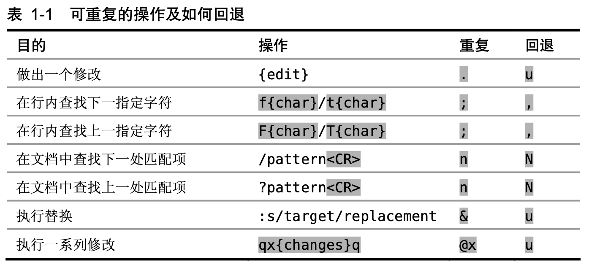

# VIM
记录vim学习，方便回顾。

## 模式
- 普通模式：按ESC进入（默认模式）。
- 插入模式：按i进入。

## 常用快捷操作
- x - 删除光标。
- dd - 删除一行。
- u - 撤销更改。
- . - 重复上一次插入模式的所有动作（录制功能）。
- a - 在当前光标之后添加内容。
- A - 在当前行结尾添加内容。
- h - 光标向左移动。
- j - 光标向下移动。
- k - 光标向右移动。
- l - 光标向右移动。
- s - 删除光标下的字符并进入插入模式。
- f{char} - 找到下一个指定字符出现的位置，当需要继续重复查找时，使用;命令会重复查找动作。
- ; - 重复上一个f{char}查找动作。
- \* - 查找光标所在的单词，并跳转到下一个出现的单词。
- n - 跳转到下一个使用\*查找的单词匹配项。
- cw - 删除从光标位置到单词结尾间的字符，并进入插入模式。
- c3w - 一次性删除三个单词，并进入插入模式
- db - 反向删除,从光标起始的位置单词开头的内容。
- dw - 正向删除，删除光标到单词末尾的字符。
- b - 把光标移动到单词的开头。
- daw - 删除一个单词，并且还会删除前边的所有空格，并跳转到前一个单词的末尾。
- d3aw - 删除三个单词，同上
- yyp - 复制一行到下一行，并跳转到下一行
## 图示

